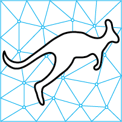

K2Engineering
=============

This repository contains a set of customised Kangaroo2 grasshopper components with the scope of calibrating the goals with regard to structural properties.

Building from source
====================

TODO

Feedback and enhancements
=========================

Please report any bugs or requests for enhancement in the GitHub issue tracker.

License
=======

This software is licensed under the Apache 2 license: http://www.apache.org/licenses/LICENSE-2.0